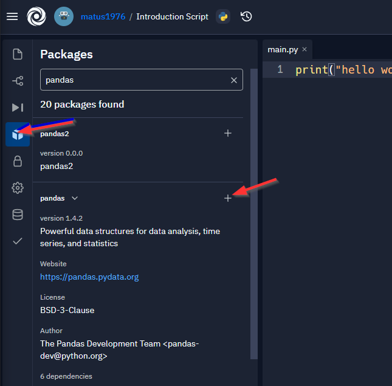
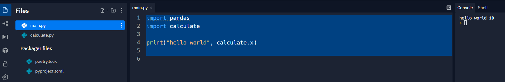
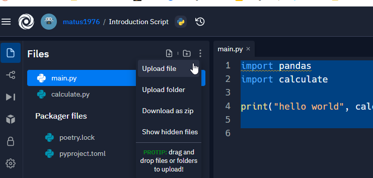
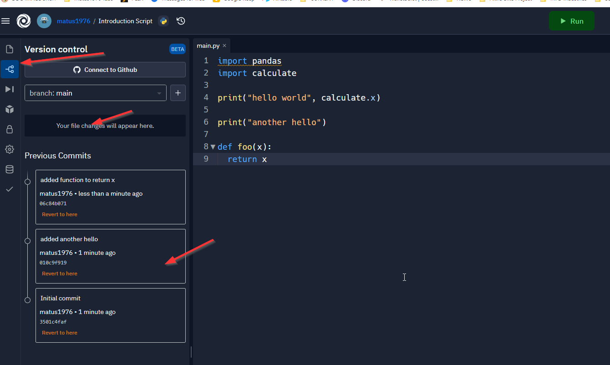
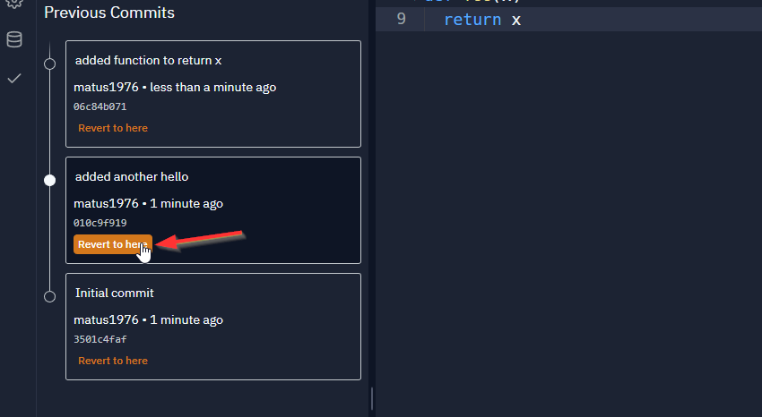
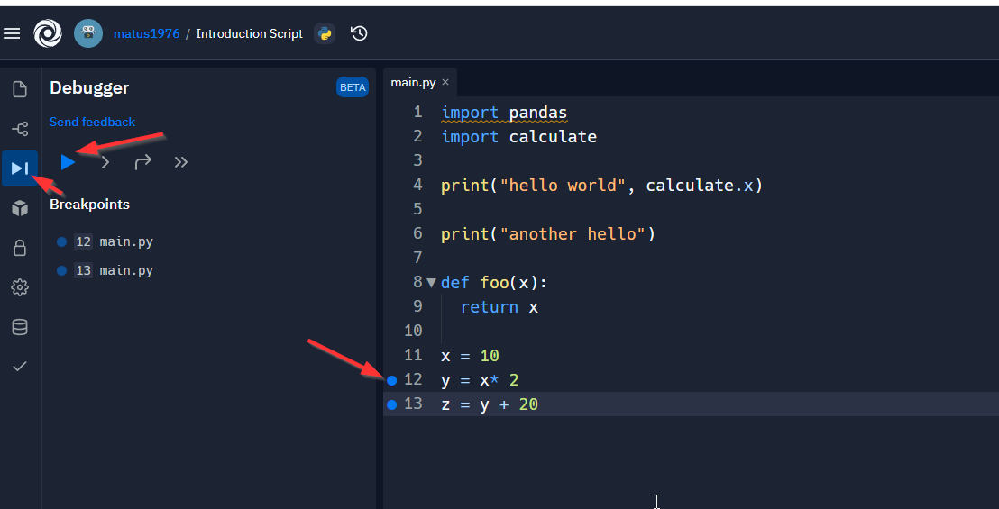
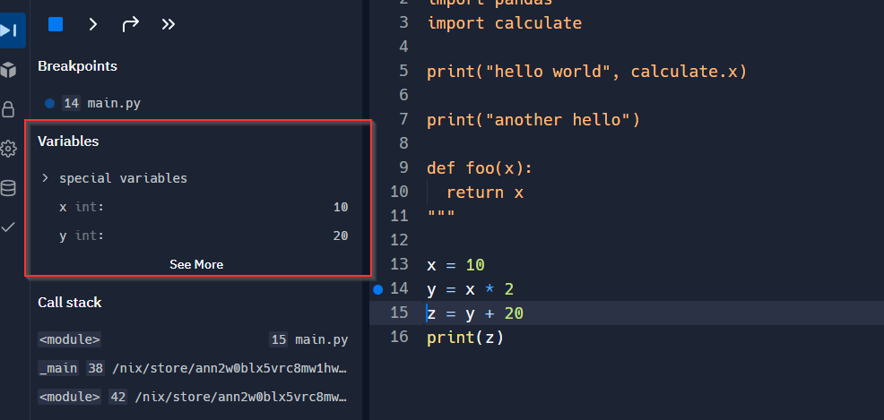

# Introduction


Course Content - Authomation is the theme

make you a master of python

learn to automate everything that is possible to be automated

programs that will batch operation

SMS messages, access browser, click and get data

chat bots, PDF files, etc

Course does not cover python basics

- lists variables conditionals loops etc

Stuck? Google search or stack overflow search, also Q&A forum. 


# The IDE

This courses uses replit.com you can copy all your code from there, create a repl account and click fork repl

go to https://replit.com/@ArditS/The-IDE

create a replit account

if you type in after the URL but add done to the end you get the completed code:

https://replit.com/@ArditS/The-IDE-done 

and fork that


# 3 using the IDE

using the REPL IDE

"integrated development environment"

basically the text editor where you develop your programs

- how to navigate repl directory
- how to create a new repl
- how to write and run programs in repl 
- how to upload files in repl
- collaboration

A repl is a virtual instance you can access form your browser

in repl  you can install any packages you'd like

install pandas package:



now you can import it:

```
import pandas

print("hello world")
```

you can create another py file in your repl, and import it



repl will always run the main.py file, always executing `python main.py` 

your main script should always be `main.py`

can create other file types, folders, and drag and drop in repl

can also upload



## using Git





debugging in repl





step through breakpoints


