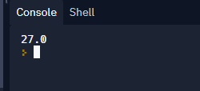

# Section 2

# 5. scraping text with selenium


scaping sample text from automated.pythonanywhere.com

install selenium

in repl:


need to do an update to settings if you didn't fork author's repl. show hidden files:


open `replit.nix`

add two new lines:

```
pkgs.chromium
pkgs.chromedriver
```


close file then hide those files again

now you can go ahead and import selenium in your main.py

```
from selenium import webdriver
```

then create a driver variable

```
driver = web.driver.Chrome()
```

Add options for selenium and put it in a function `get_driver`

```
from selenium import webdriver

def get_driver():
  ## Set options to make browsing easier:
  options = webdriver.ChromeOptions()
  # on your browser you have info bars, may interfere with script, so this disables it
  options.add_argument("disable-infobars")   
  
  # starts the browser as maximized
  options.add_argument("start-maximized")
  
  # disable some issues often encountered on linux boxes
  options.add_argument("disable-dev-shm-usage")
  
  # give program greater privs on that web page script will scrape
  options.add_argument("no-sandbox")
  
  # this experiemental option helps selenium avoid detection from the browser when websites try to detect scripts
  options.add_experimental_option("excludeSwitches",["enable-automation"])
  
  options.add_argument("disable-blink-features=AutomationControlled")
  
  driver = webdriver.Chrome()
  driver.get("https://automated.pythonanywhere.com/")
  return driver
```

create new function `main` to get the elements

```
def main():
  driver = get_driver()
  element = driver.find_element_by_xpath("")
```

the `find_element_by_xpath` will identify and return that specific text identified by `xpath`

to get the xpath for that web element, open inspect in the browser, then click copy and copy xpath:


result:

`/html/body/div[1]/div/h1[1]`

error:

> ", line 81, in start
>     raise WebDriverException(
> selenium.common.exceptions.WebDriverException: Message: 'chromedriver' executable needs to be in PATH. Please see https://chromedriver.chromium.org/home

response from instructor

> [Ardit](https://www.udemy.com/user/adiune/) — Instructor
>
> 0 upvotes0
>
> 
>
> 15 hours ago
>
> Hi Michael, the solution is to not create a new Repl, but fork my Repl instead. You can find my Repl links attached as lecture resources. For your convenience, below is link to the Repl which contains the complete code for the lecture "Scraping Simple Text with Selenium":
>
> https://replit.com/@ArditS/Scrape-Simple-Text-with-Selenium-done

working code of mine in instructors forked replit (no PATH error)

```

from selenium import webdriver


def get_driver():
  ## Set options to make browsing easier:
  options = webdriver.ChromeOptions()
  # on your browser you have info bars, may interfere with script, so this disables it
  options.add_argument("disable-infobars")   
  
  # starts the browser as maximized
  options.add_argument("start-maximized")
  
  # disable some issues often encountered on linux boxes
  options.add_argument("disable-dev-shm-usage")
  
  # give program greater privs on that web page script will scrape
  options.add_argument("no-sandbox")
  
  # this experiemental option helps selenium avoid detection from the browser when websites try to detect scripts
  options.add_experimental_option("excludeSwitches",["enable-automation"])
  
  options.add_argument("disable-blink-features=AutomationControlled")

  options.add_argument("executable_path='/home/runner/Scrape-Simple-Text-with-Selenium'")
  
  driver = webdriver.Chrome(options=options)
  driver.get("https://automated.pythonanywhere.com/")
  return driver


def main():
  driver = get_driver()
  element = driver.find_element(by="xpath", value="/html/body/div[1]/div/h1[1]")
  return element.text

print(main())
```


# 6) scraping from your local IDE


>   File "06_scrape_with_selenium.py", line 2, in <module>
>     from selenium import webdriver
> ModuleNotFoundError: No module named 'selenium'

run

```
pip install selenium
```

now you get local error:

```
    self.service.start()
  File "C:\ProgramData\Anaconda3\lib\site-packages\selenium\webdriver\common\service.py", line 81, in start
    raise WebDriverException(
selenium.common.exceptions.WebDriverException: Message: 'chromedriver' executable needs to be in PATH. Please see https://chromedriver.chromium.org/home

```

go to https://chromedriver.chromium.org/downloads

find out what version of chrome you have: 

search what is my browser and go to https://www.whatismybrowser.com/

add:

```
from selenium.webdriver.chrome.service import Service

#location of the chromedriver.exe you just downloaded:
service = Service('C:\\Users\\Matus1976\\Downloads\\chromedriver_win32\\chromedriver.exe') 
```

change

```
  driver = webdriver.Chrome(options=options)
```

to

```
  driver = webdriver.Chrome(service=service, options=options)
```


# 7) scraping dynamic value

if you right click and inspect this changing element you get only `/div` as the xpath, so sometimes this doesn't work

/div


the previous xpath was:

```
"/html/body/div[1]/div/h1[1]"
```

/html means this document

/body isthe main tag and contains the div tag you grabbed

there are two `/div` under body though


so you were getting the first instace of div under body with `html/body/div[1]` and under that the first div and first header with `/div/h1[1]` 

so now you want the 2nd header


you can also right click and get full xpath in chrome inspect

sometimes

so now you are using:

```
def main():
  driver = get_driver()
  element = driver.find_element(by="xpath", value="/html/body/div[1]/div/h1[2]")
  return element.text
```

but the returned text doesn't have the value:

```
Average World Temperature Now:
 
```

this is because the value doens't appear for a few seconds

so add a pause

```
import time

...

def main():
  driver = get_driver()
  time.sleep(2)          #pause for 2 seconds
  element = driver.find_element(by="xpath", value="/html/body/div[1]/div/h1[2]")
  return element.text
```

result


Let's make a new function that grabs just that number:

use split

```
Average World Temperature Now: 28
 "average : 22".split(": ")
['average ', '22']

```

new program

```

from selenium import webdriver
import time


def get_driver():
  ## Set options to make browsing easier:
  options = webdriver.ChromeOptions()
  # on your browser you have info bars, may interfere with script, so this disables it
  options.add_argument("disable-infobars")   
  
  # starts the browser as maximized
  options.add_argument("start-maximized")
  
  # disable some issues often encountered on linux boxes
  options.add_argument("disable-dev-shm-usage")
  
  # give program greater privs on that web page script will scrape
  options.add_argument("no-sandbox")
  
  # this experiemental option helps selenium avoid detection from the browser when websites try to detect scripts
  options.add_experimental_option("excludeSwitches",["enable-automation"])
  
  options.add_argument("disable-blink-features=AutomationControlled")

  options.add_argument("executable_path='/home/runner/Scrape-Simple-Text-with-Selenium'")
  
  driver = webdriver.Chrome(options=options)
  driver.get("https://automated.pythonanywhere.com/")
  return driver

def clean_text(text):
  """ extract only the temperature from the text """
  output = float(text.split(": ")[1])
  #splits it at the `: `, gets 2nd index, and converts to float
  return output


def main():
  driver = get_driver()
  time.sleep(2)          #pause for 2 seconds
  element = driver.find_element(by="xpath", value="/html/body/div[1]/div/h1[2]")
  return clean_text(element.text)
  

print(main())
```

works



next get this working  locally

# 8) Automate Login Process

your script will login to this form https://automated.pythonanywhere.com/login/

script logins and then clicks on the home page

script will need the url https://automated.pythonanywhere.com/login/

username is automated

pw is automatedautomated

updated website

```
  driver = webdriver.Chrome(options=options)
  driver.get("https://automated.pythonanywhere.com/login/")
  return driver
```

update element

we don't need to use xpath, you can use the id if it's there


id = "id_username" whenever that's present you can use it

```
def main():
  driver = get_drvier()
  element = driver.find_element(by="id", value="id_username")
  return element.text
```

also we want to send keys

```
def main():
  driver = get_drvier()
  element = driver.find_element(by="id", value="id_username").send_keys("automated")
  return element.text
```

don't need to assign it or return anything either

```
def main():
  driver = get_drvier()
  driver.find_element(by="id", value="id_username").send_keys("automated")
  # return element.text
```

works

```
def main():
  driver = get_drvier()
  driver.find_element(by="id", value="id_username").send_keys("automated")
  driver.find_element(by="id", value="id_password").send_keys("automatedautomated")
```

works, but add a sleep to slow things down, 

```
import time

def main():
  driver = get_drvier()
  driver.find_element(by="id", value="id_username").send_keys("automated")
  time.sleep(2)
  driver.find_element(by="id", value="id_password").send_keys("automatedautomated")
```

and send a RETURN

```
import selenium.webdriver.common.keys import Keys

def main():
  driver = get_drvier()
  driver.find_element(by="id", value="id_username").send_keys("automated")
  time.sleep(2)
  driver.find_element(by="id", value="id_password").send_keys("automatedautomated" + Keys.RETURN)
```

so the whole program now looks like

```
from selenium import webdriver
from selenium.webdriver.common.keys import Keys
import time

def get_drvier():
  # Set options to make browsing easier
  options = webdriver.ChromeOptions()
  options.add_argument("disable-infobars")
  options.add_argument("start-maximized")
  options.add_argument("disable-dev-shm-usage")
  options.add_argument("no-sandbox")
  options.add_experimental_option("excludeSwitches", ["enable-automation"])
  options.add_argument("disable-blink-features=AutomationControlled")

  driver = webdriver.Chrome(options=options)
  driver.get("https://automated.pythonanywhere.com/login/")
  return driver

def main():
  driver = get_drvier()
  driver.find_element(by="id", value="id_username").send_keys("automated")
  time.sleep(2)
  driver.find_element(by="id", value="id_password").send_keys("automatedautomated" + Keys.RETURN)

print(main())
```

last you can add this to display your url to know it worked

```
def main():
  driver = get_drvier()
  driver.find_element(by="id", value="id_username").send_keys("automated")
  time.sleep(2)
  driver.find_element(by="id", value="id_password").send_keys("automatedautomated" + Keys.RETURN)
  print(driver.current_url) #<---

```


Next we want to click on the Home button


