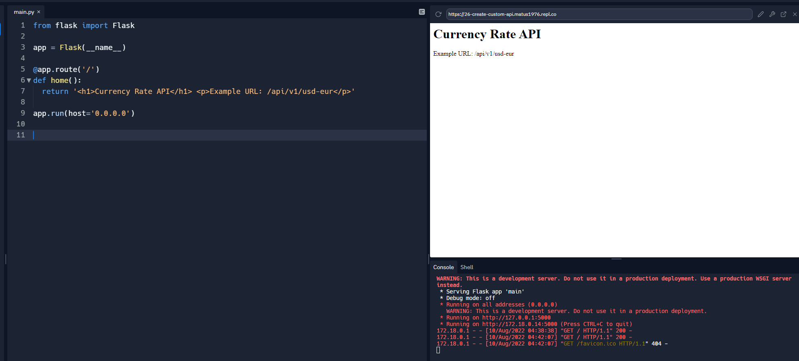

# 4 Building and using APIs

In this section, you will access various APIs with Python and even create your own APIs

 get a free News API following the steps below:

\1. You go to https://newsapi.org/

Representation State Transfer Application Process Interface

an API is a way for two applications to communicate, like HTML web pages are for people to communicate clearly with each oter, API is for apps to communicate clearly with each other

json is the usual format served by APIs

use the `requests` module

```
import requests
r = requests.get()
```

with the url, it will print the unformatted json

```
import requests

r = requests.get('https://newsapi.org/v2/everything?qInTitle=stock%20market&from=2022-6-27&to=2022-6-28&sortBy=popularity&language=en&apiKey=890603a55bfa47048e4490069ebee18c')

content = r.json()

print(content)
```


you can get individual keys with 

it's actually a dictionary, but only 3 keys

```
# print(content)

print(type(content))
print(len(content))
```

```
$ python local/04-21_rest_api.py
<class 'dict'>
3
```

getting individual keys

```
print(type(content))
print('dictionary len is: ', len(content))
print('status is: ', content['status'])
print('total results is: ', content['totalResults'])
```

```
$ python local/04-21_rest_api.py
<class 'dict'>
dictionary len is:  3
status is:  ok
total results is:  181

```

get the title of the first article

```
# get the title of the first article
print(content['articles'][0]['title'])

```

```
$ python local/04-21_rest_api.py
<class 'dict'>
dictionary len is:  3
status is:  ok
total results is:  181
Sterling rises against dollar as stock market rallies - Reuters.com

```


your python application is communicating through url parameters

```
r = requests.get('https://newsapi.org/v2/everything?qInTitle=stock%20market&from=2022-6-27&to=2022-6-28&sortBy=popularity&language=en&apiKey=890603a55bfa47048e4490069ebee18c')

# this ^ url has parameters that are used to filter the results and can be modified, e.g. to get united states news instead of 'stock market':
# https://newsapi.org/v2/everything?qInTitle=united%20states&from=2022-6-27&to=2022-6-28&sortBy=popularity&language=en&apiKey=890603a55bfa47048e4490069ebee18c

content = r.json()
```

r is a request object

if you apply the .json() method to that object, that's what converts it to a dictionary

print all the article titles:

```
# print all the article titles 
articles = content['articles']
print(type(articles))

for article in articles:
    print(article['title'])
```

additional article info:

```
for article in articles:
    print("> Title: ", article['title'])
    print("  Description: ", article['description'])
    print("  URL: ", article['url'])
```

use `f'string'` to construct string urls:

```
# we want the user to define the search parameters
def get_news(topic, from_date, to_date, language=en, api_key='890603a55bfa47048e4490069ebee18c'):
    url = f'https://newsapi.org/v2/everything?qInTitle={topic}&from={from_date}&to={to_date}&sortBy=popularity&language={language}&apiKey={api_key}'

```

22 - 12:00 min

## 23 - News API getting top headlines for any country

## 24 - Weather Forecast API


appends weather forecast to a text file output so you're using 'a' for append instead of 'w' 

openweathermap.org


```
import requests

def get_weather():
    url = f'https://api.openweathermap.org/data/2.5/weather?q=Kent,wa,us&APPID=<<API KEY>>&units=imperial'
    request_result = requests.get(url)
    content = request_result.json()
    #print(content)
    return(content)

def get_forecast():
    url = f'https://api.openweathermap.org/data/2.5/forecast?q=Kent,wa,us&cnt=8&APPID=<<API KEY>>&units=imperial'
    request_result = requests.get(url)
    content = request_result.json()
    #print(content)
    return(content)

weather_content = get_weather()
forecast = get_forecast()

todays_temps = []

for n in range(8):
    #print(n, forecast['list'][n]['main']['temp'])
    todays_temps.append(forecast['list'][n]['main']['temp'])

#print(forecast['list'][0]['weather'][0]['description'])

todays_weather = []

for n in range(8):
    #print(n, forecast['list'][n]['weather'][0]['description'])
    todays_weather.append(forecast['list'][n]['weather'][0]['description'])

# display the weather for the day 
print(" ")
print("The current weather for ", (weather_content['name']), "is: ", weather_content['weather']
      [0]['description'], " and a temp of ", weather_content['main']['temp'], " degrees.")
print(" ")
for n in range(8):
    print(forecast_hours[n], " ", todays_temps[n], " degF, ", todays_weather[n])
    #print(" ")
print(" ")

```


next combine this with your news aggregator


## 26 Create your own currency rate REST API

build your own API

serves the current currency rate to your request

client makes request to your API through URLs


https://replit.com/@matus1976/26-create-custom-api#main.py

web framework - use flask

```
from flask import Flask

app = Flask(__name__)

@app.route('/')
def home():
  return '<h1>Currency Rate API</h1> <p>Example URL: /api/v1/usd-eur</p>'

```


if you're on repl you need to pass this to see the web page

```
app.run(host='0.0.0.0')
```

if you are running locally you would need to install it with `pip install flask`

run this in repl and it will work



or paste the URL into your browser

`https://26-create-custom-api.matus1976.repl.co/

you need to add a app line to process the request

```
@app.route('api/v1/usd-eur')
```

in this case though, `usd` and `eur` are static, to accept dynamic vars:

```
@app.route('api/v1/<in_cur>-<out_cur>')
```

use those as inputs in a function

```
@app.route('api/v1/<in_cur>-<out_cur>')
def api(in_cur, out_cur):
```

get the current rate from xrate:

```
#scrape the current rate from xrate
from bs4 import BeautifulSoup
import requests

def GetCurrency(input_currency, output_currency):
    """ gets the current currency exchange rate and returns the rate """
    url = f"https://www.x-rates.com/calculator/?from={input_currency}&to={output_currency}&amount=1"
    content = requests.get(url).text
    print(url)
    #print(content)
    soup = BeautifulSoup(content, 'html.parser')
    #print(soup)
    raw_currency = soup.find("span", class_="ccOutputRslt").get_text()
    print(raw_currency)

    raw_currency_length = len(raw_currency)
    #print(raw_currency_length)
    currency = (raw_currency[0:raw_currency_length-4])
    #print(repr(currency))
    currency = float(currency)
    #print(type(currency))
    rate = currency
    return rate


GetCurrency("EUR", "AUD")
```

get the input and output cur and put then in the getCurrency func, also define the API output

```
def api(in_cur, out_cur):
  rate = GetCurrency(in_cur, out_cur)
  result_dictionary= {'input_currency':in_cur, 'output_currency':out_cur, 'rate':rate}
  return
```

also you need to import `jsonify`

```
from flask import Flask, jsonify
```

```def api(in_cur, out_cur):
  rate = GetCurrency(in_cur, out_cur)
  result_dictionary= {'input_currency':in_cur, 'output_currency':out_cur, 'rate':rate}
  return jsonify(result_dictionary)
```

so now you have:

```
from flask import Flask, jsonify

#scrape the current rate from xrate
from bs4 import BeautifulSoup
import requests

def GetCurrency(input_currency, output_currency):
    """ gets the current currency exchange rate and returns the rate """
    url = f"https://www.x-rates.com/calculator/?from={input_currency}&to={output_currency}&amount=1"
    content = requests.get(url).text
    #print(url)
    #print(content)
    soup = BeautifulSoup(content, 'html.parser')
    #print(soup)
    raw_currency = soup.find("span", class_="ccOutputRslt").get_text()
    #print(raw_currency)

    raw_currency_length = len(raw_currency)
    #print(raw_currency_length)
    currency = (raw_currency[0:raw_currency_length-4])
    #print(repr(currency))
    currency = float(currency)
    #print(type(currency))
    rate = currency
    return rate


#GetCurrency("EUR", "AUD")

app = Flask(__name__)

@app.route('/')
def home():
  return '<h1>Currency Rate API</h1> <p>Example URL: /api/v1/usd-eur</p>'

@app.route('/api/v1/<in_cur>-<out_cur>')
def api(in_cur, out_cur):
  rate = GetCurrency(in_cur, out_cur)
  result_dictionary= {'input_currency':in_cur, 'output_currency':out_cur, 'rate':rate}
  return jsonify(result_dictionary)
  

app.run(host='0.0.0.0')

```


and now go to `https://26-create-custom-api.matus1976.repl.co/api/v1/usd-eur

and the result:


up next: 

## 27 Official Facebook Graph API

access data from profiles by using the facebook API

download image through facebook API:


## 28 Grammar Correction API

grammar checking with python

using an API called language tool API

this will work through a post request not a get request

go to https://languagetool.org/http-api/

url is `https://api.languagetool.org/v2/check

```
import requests
url = 'https://api.languagetool.org/v2/check'
response = requests.post(url)       #using post now, before we used get
```

but you'll need to pass parameters

we can pass text, json, langage etc 


language and text are required

we pass them as dictionary

```
import requests

url = 'https://api.languagetool.org/v2/check'

# create data as dictionary to pass for language check:
data = {
    'text':'Tis is a nixe day!',
    'language':'auto'
    }

response = requests.post(url, data)       #using post now, before we used get

print(response.text)
```

returns a block of text


check type

```

# check the type of the output
print(type(response.text))

```

it's a string, so we need to convert it to a dict, we can use ``json.load()` which converts string to a dictionary

```
import json

result = json.loads(response.text)

print(result)
```

so now you have:

```
import requests
import json 

url = 'https://api.languagetool.org/v2/check'

# create data as dictionary to pass for language check:
data = {
    'text':'Tis is a nixe day!',
    'language':'auto'
    }

response = requests.post(url, data)       #using post now, before we used get

print(response.text)

# check the type of the output
print(type(response.text))

result = json.loads(response.text)
print(result)
```

you allready know how to extract data from a dictionary. 


