# 5 Working with Computer Files and Folders


## 29. intro to python pathlib library

using the pathlib library

standard of python - installed by default

first showed up in v 3.4 substitute of the os library

both os and pathlib are useful for file and directory operations

os treats filepaths as strings but pathlib use a path object type

- paths used to be treated as strings

first you need to think of the path:

```
p1 = 'files/abc.txt'
with open(p1, 'r') as file:
 print(file.read())
```

- now pathlib recognizes paths as object types

```
from pathlib import Path

p1 = Path('files/abc.txt')
print(type(p1))
print(p1)
```

```
$ python local/04-29_python_pathlib_library.py
<class 'pathlib.WindowsPath'>
files\abc.txt

```

benefits not visible in this example but if your code expands 

it has many methods you can check methods with Dir(Path):

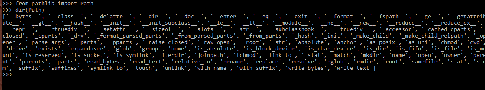

```
# you can also write files if the file doesn't exist
p1 = Path('new_file.txt')

if not p1.exists():
    with open(p1, 'w') as file:
        file.write('file_contents')
```

you can print just the filename:

`print(p1.name)`

get filename without extension

`print(p1.stem)`

or just extension

`print(p1.suffix)`

it's much more work to do this with os.path, these are all methods of the Path class

```
from pathlib import Path

# reading files:
#p1 = Path('files/abc.txt')
#print(type(p1))
#print(p1)

# you can also write files if the file doesn't exist
p1 = Path('new_file.txt')

if not p1.exists():
    with open(p1, 'w') as file:
        file.write('file_contents')

#you can print just the filename:
print(p1.name)

# get filename without extension
print(p1.stem)

# or just extension
print(p1.suffix)

#it's much more work to do this with os.path, these are all methods of the Path class

# let's print the filename of files in a directory
p2 = Path('files')
print(p2.iterdir())
for item in p2.iterdir():
    print(item)
```


## 30. Add prefix to all filenames in a folder

first, determine where / in what folders these files are, what is the root directory holding the files

need to run it from the right folder (not local/*.py)

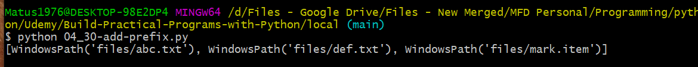

lets start with:

```
from pathlib import Path

# how do you rename files in a path 

root_dir = Path('files')            # create a Path object instance with files as a string 
file_paths = root_dir.iterdir()     # this method outputs a file generator 
print(list(file_paths))             # prints the files in the directory
```

outputs:


let's list all the files:

```
from pathlib import Path

# how do you rename files in a path 

root_dir = Path('files')            # create a Path object instance with files as a string 
file_paths = root_dir.iterdir()     # this method outputs a file generator 
#print(list(file_paths))             # prints the files in the directory

for path in file_paths:
    new_filename = "new_" + path.stem + path.suffix  
    print(new_filename)
```

result:

```
Matus1976@DESKTOP-98E2DP4 MINGW64 /d/Files - Google Drive/Files - New Merged/MFD Personal/Programming/python/Udemy/Build-Practical-Programs-with-Python/local (main)
$ python 04_30-add-prefix.py
new_abc.txt
new_def.txt
new_mark.item
```


this is just printing to the screen with the new name, they are not renamed. 

you need to use class path.with_name(new_filename)

```
from pathlib import Path

# how do you rename files in a path 

root_dir = Path('files')            # create a Path object instance with files as a string 
file_paths = root_dir.iterdir()     # this method outputs a file generator 
#print(list(file_paths))             # prints the files in the directory

for path in file_paths:
    new_filename = "new_" + path.stem + path.suffix
    new_filepath = path.with_name(new_filename)
    print(new_filename)
    path.rename(new_filepath)

"""
we're about to add path.rename(new_filepath) to the for loop
so rename is a class of the path object and takes the argument (new_filepath)
but if we do this, the files actually move up outside the file path
instead we point to path.with_name
"""
```


# 31 - Rename All Files Based on Folder

going to rename all files in a folder to the prefix of the folder

e.g. a bunch of files in \November and a bunch in \December and then adding the name of the folder to each file, so \November\abc.txt will be renamed to \November\November-abc.txt

start with the Path module, defining the root dir and instantiating the file_paths class:

```
from pathlib import Path 

root_dir = Path('files')

file_paths = root_dir.iterdir()

for path in file_paths:
    print(path)
```

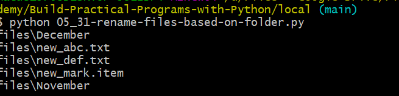

get the list of files inside each folder:

```
from pathlib import Path 
root_dir = Path('files')
file_paths = root_dir.iterdir()

for path in file_paths:
    for filepath in path.iterdir():     # gives list of files inside current folder
        print(path)
```

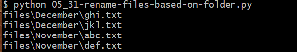


There's a more elegant way though you can use `glob(pattern)` instead

```
from pathlib import Path 

root_dir = Path('files')

file_paths = root_dir.glob("**/*")

for path in file_paths:
    print(path)

```

includes everything including first level files

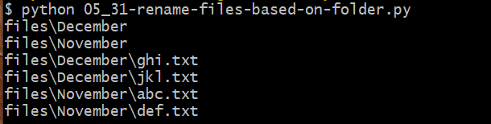


you can use `path.is_file():` to check if it is a file and only then print it or act on it:

```
from pathlib import Path 
root_dir = Path('files')
file_paths = root_dir.glob("**/*")

for path in file_paths:
    if path.is_file():          # checks if it's a file returns true 
        print(path)
```

seperate the parts of the path/filename out using `path.parts`:

```
from pathlib import Path 
root_dir = Path('files')
file_paths = root_dir.glob("**/*")

for path in file_paths:
    if path.is_file():          # checks if it's a file returns true 
        # print(path)
        # get the name of the folder the file is in:
        parent_folder = path.parts
        print(parent_folder)
        #new_filename = path.
```

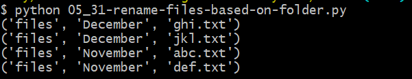

but it's split into different items in a tuple

since it's a tuple use [-2], counting from right to left it's -1, -2, -3 etc

```
parent_folder = path.parts[-2]
```

```
from pathlib import Path 
root_dir = Path('files')
file_paths = root_dir.glob("**/*")

for path in file_paths:
    if path.is_file():          # checks if it's a file returns true 
        # print(path)
        # get the name of the folder the file is in:
        parent_folder = path.parts[-2]
        print(parent_folder)

```

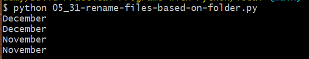

construct the new filename with

```
        new_filename = parent_folder + '-' + path.name
```

and you use path.with_name and path.rename:

```
from pathlib import Path 
root_dir = Path('files')
file_paths = root_dir.glob("**/*")

for path in file_paths:
    if path.is_file():          # checks if it's a file returns true 
        # print(path)
        # get the name of the folder the file is in:
        parent_folder = path.parts[-2]
        #print(parent_folder)
        
        new_filename = parent_folder + '-' + path.name
        print(new_filename)

        new_filepath = path.with_name(new_filename)     # creaeting a new path object here 
        path.rename(new_filepath)                       # apply rename to the path object
```

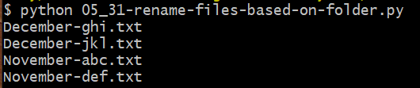

and the files get renamed:

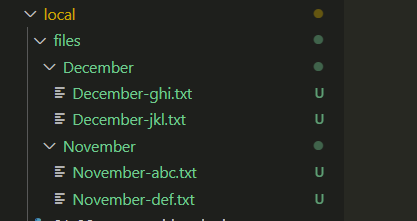

## 32 - Renaming Files based on a sub-sub folder

fork @ArditS repl Rename Files Based on the sub-sub folders

https://replit.com/@matus1976/Rename-Files-Based-on-the-sub-sub-folders-Exercise#main.py

resulting code:

```
# file names should contain folder and parent / grandparent folders

from pathlib import Path

root_dir = Path('files')  #defines the local root directory

#print(root_dir)
#print(type(root_dir))
#print("file_paths is: ", file_paths)
#print("printing list(file_paths)")
#print(list(file_paths))

#file_paths = root_dir.iterdir()
file_paths = root_dir.glob("**/*")

for path in file_paths:
    if path.is_file():  # only if it's a file print on it or act on it
        print(path)
        parent_folder = path.parts[-3:-1]
        print("parent folder is: ", parent_folder)

        #construct new filename
        new_filename = parent_folder[0] + "-" + parent_folder[
            1] + "-" + path.name
        print("new_filename is: ", new_filename)

        #construct new filepath
        new_filepath = path.with_name(
            new_filename)  #creating a new path object here
        print("new_filepath is: ", new_filepath)

        path.rename(new_filepath)

```

definitely need to select the right range of the tuple here:

```
 parent_folder = path.parts[-3:-1]
```

to get all the parent folders

## 33 - instructors solution

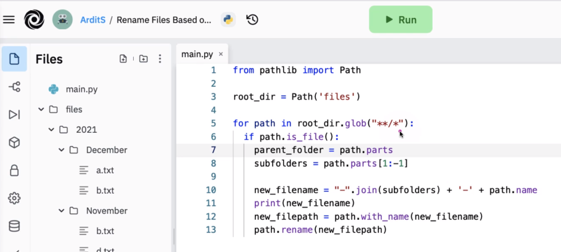

you can use the join method instead

```
new_filename = "-".join(subfolders)
```

it joins those items and palves the - seperator between them. 


## 34 - add created date to all filenames in folder

how to get the date when a file was created via python and then an exercise to rename a file adding the dates when they were created. 

https://replit.com/@matus1976/Add-File-Created-Date-to-All-Filenames-Exercise#main.py

how to get the date when the file was created

```
from pathlib import Path
from datetime import datetime

path = Path('files/December/a.txt')

# if you have a path object you can get data about that object with the path.stat() method

stats = path.stat()

print(stats)
"""
result of print(stats):
$ python main.py
os.stat_result(st_mode=33188, st_ino=264, st_dev=19923088, st_nlink=1, st_uid=1000, st_gid=1000, st_size=2, st_atime=1635878203, st_mtime=1635878203, st_ctime=1665005893)

st_mode some info about permissions
st_uid user identifier
st_gid user group identifier
st_size = file size

what we want is time:

st_atime - last access time stamp, seconds from jan1 1970
st_mtime - when file was last modified
st_ctime - when the file was created
"""

# to get that ctime:
seconds_when_created = stats.st_ctime
print(seconds_when_created)
"""
output:
$ python main.py
os.stat_result(st_mode=33188, st_ino=264, st_dev=19923088, st_nlink=1, st_uid=1000, st_gid=1000, st_size=2, st_atime=1635878203, st_mtime=1635878203, st_ctime=1665005893)
1665005893.6959639
"""

# to convert epoch time to normal time in python:
date_created = datetime.fromtimestamp(seconds_when_created)
print(date_created)
"""
$ python main.py
os.stat_result(st_mode=33188, st_ino=264, st_dev=19923088, st_nlink=1, st_uid=1000, st_gid=1000, st_size=2, st_atime=1635878203, st_mtime=1635878203, st_ctime=1665005893)
1665005893.6959639
2022-10-05 21:38:13.695964
"""

# date_created is not a string though, need to convert it
date_created_str = date_created.strftime(
    "%Y-%m-%d_%H:%M:%S")  #creates a string from time

print(date_created_str)
print(type(date_created_str))
"""
1665005893.6959639
2022-10-05 21:38:13.695964
2022-10-05_21:38:13
<class 'str'>
"""
```

## 35 exercise renaming all files in folder with created on date time 

```
from pathlib import Path
from datetime import datetime

# update file names with datetime created:

root_dir = Path('files')  #defines the local root directory
file_paths = root_dir.glob("**/*")

for path in file_paths:
    #print(path)
    if path.is_file():  # only if it's a file print on it or act on it
        print(path)
        #print(type(path))
        file_stats = path.stat()
        #print(file_stats)

        # get time stampe when created
        seconds_when_created = file_stats.st_ctime
        #print(seconds_when_created)

        #convert epoch timestamp
        date_created = datetime.fromtimestamp(seconds_when_created)
        #print(date_created)

        #format date created string
        date_created_str = date_created.strftime(
            "%Y-%m-%d_%H:%M:%S")  #creates a string from time
        print(date_created_str)

        #create new filename
        new_filename = date_created_str + "-" + path.name
        print("new filename is: ", new_filename)

        #create new file path
        new_filepath = path.with_name(new_filename)
        print("new_filepath is: ", new_filepath)

        #rename the file
        path.rename(new_filepath)
```

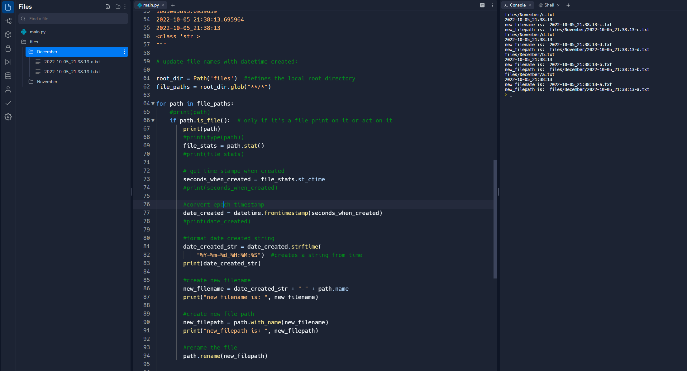

https://replit.com/@matus1976/Add-File-Created-Date-to-All-Filenames-Exercise#main.py

# 36) change extension from .txt to .csv

```
from pathlib import Path
from datetime import datetime

# change file extension from .txt to .csv

root_dir = Path('files_36')  # defines the local root directory
file_paths = root_dir.glob("**/*")

for file in file_paths:
    if file.is_file():
        #print filename
        print(file)

        #get filename without extension
        filename_without_extension = file.stem
        
        #create new filename
        new_filename = filename_without_extension + ".csv"
        print("new filename is: ", new_filename)

        #create new file path
        new_filepath = file.with_name(new_filename)
        print("new_filepath is: ", new_filepath)

        #rename the file
        file.rename(new_filepath)
```

# 37) change file extension solution

from instructor

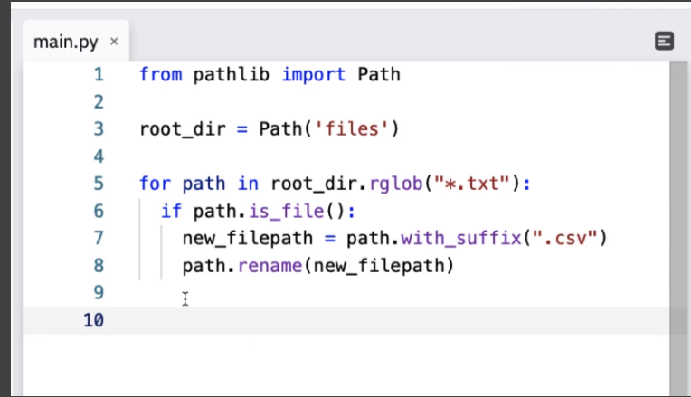

the rglob selects only those files

you can use rglob("*") for all files

you can use path.with_suffix(".txt") to just update the suffix

rglob is alternative to glob - useful when you have subfolders 

rglob is the equivalent of `**/*.csv` 

# 38) Create Empty files

script to create a bunch of empty files

first we need to import pathlib

```
from pathlib import Path
```

and then set the root directory

```
root_dir = Path('files_38')
```

```
from pathlib import Path 

# set root directory
root_dir = Path('files_38')                     # defines the local root directory

for i in range(10,21):                          # creates 10 files with numbers from 10 - 21
    filename = str(i) + '.txt'                  # construct a filename as a string
    filepath = root_dir / Path(filename)        # construct a filepath as a Path object
    filepath.touch()                            # create an empty file
```


# 39) create a zip archive from files

use the zipfile library to create zip files:

```
import zipfile
```

```
from pathlib import Path
import zipfile

root_dir = Path('files_39')   
# defines the local root directory

#archive_path = Path('archive.zip')
# defines the archive file name and creates a Path object
# add 'root_dir /' to make it files/archives.zip
# add 'root_dir / archive_path' to make it files/files_39/archive.zip

archive_path = root_dir / Path('archive.zip')   
# defines the archive file name and creates a Path object

with zipfile.ZipFile(archive_path, 'w') as zip_object:         # creates a ZipFile object, 'w' is the mode for write. 
                                                               # ok what do we want to do with this object? probably iterate through it
    for path in root_dir.rglob("*.txt"):                       # iterate through all the files in the root_dir
        zip_object.write(path)
```


# 40) extract zip files

starting off with two zipped files full of either text or csv

put the filesets inside of two different folder. 

start with importing Path and zipfile

```
from pathlib import Path
import zipfile
```

iterate through the objects looking for zips, using read and extract. 

```
from pathlib import Path
import zipfile

root_dir = Path('files_40')                     # defines the local root directory
#root_dir = Path('.') # if the files are in the same working directory as the script

#lets also define destination dir/path 
destination_path = Path('destination')

for path in root_dir.glob("*.zip"):                                     #rglob will go inside each of the folders, rglob is recursive glob
    with zipfile.ZipFile(path, 'r') as zf:                              #zf is the zip file object, 'r' is the mode for read, 'w' is the mode for write
        final_path = root_dir / destination_path / Path(path.stem)      # path.stem is the name of the file without the extension                                               
        zf.extractall(path=final_path)                                  #this is the method that extracts the files     
```

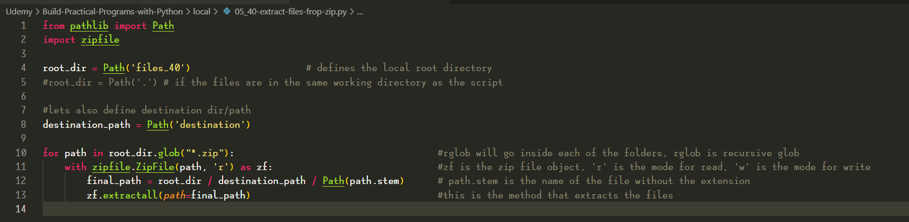


# 41) - Exercise search file in Computer

search a destination folder for a specific file

output will look something like this:


how do you get the absolute path for a file?

```
from pathlib import Path

path = Path('destination/items1/10.csv')
print(path.absolute())
```

\# output example:

```
$ python 05_41-search-for-file.py

C:\Files\MFD Personal\Programming\python\Udemy\Build-Practical-Programs-with-Python\local\destination\items1\

10.csv
```

## list all files in a folder

```
# prompt for string to search for in files
search_string = input('Enter a string to search for: ')

root_dir = Path('destination')      # defines the local root directory
file_paths = root_dir.glob("**/*")

# get a list of all files in the directory
for file in file_paths:
    if file.is_file():
        print(file)
                          
```


final program:

```
# search a destination folder for a specific file

from pathlib import Path

# how do you get the abolute path of a file?
#path = Path('destination/items1/10.csv')
#print(path.absolute())

# output example:
###
#$ python 05_41-search-for-file.py
#C:\Files\MFD Personal\Programming\python\Udemy\Build-Practical-Programs-with-Python\local\destination\items1
#10.csv
###

# prompt for string to search for in files
search_string = input('Enter a string to search for: ')
print(" search string is: ", search_string)

#root_dir = Path('destination')      # defines the local root directory
#file_paths = root_dir.glob("**/*")

# get a list of all files in the directory
#for file in file_paths:
#    if file.is_file():
#        print(file)
                          
# find only the files that contain the search string

root_dir = Path('destination')      # defines the local root directory
file_paths = root_dir.glob("**/*")

for file in file_paths:
    if file.is_file():
        #print(" path is: ", file, " file name is: ", file.name)
        if search_string in file.name:
            print(" found: ", file.name)
            print(file.absolute())
```

# 42 - exercise searching for a file in a directory

instructor solution

```
from pathlib import Path

root_dir = Path('.')
search_term = '14'

for path in root_dir.rglob("*")
	if search_term in path.stem:
		print(path.absolute())
```

but that returns folders, so you also need if path = file


# 43) Destroy files forever

